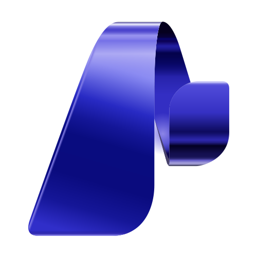

# Microsoft Foundry Template

  

As a Microsoft Solutions Engineer, I'm often asked to spin up demos, PoCs, and pilots on Microsoft Foundry, so I'm sharing the template I reach for every time. It keeps evolving alongside new Microsoft announcements, but the structure always reflects practices I've found efficient and reliable. I deliberately keep it high level so it can accommodate any tool, agent, or scenario. It's not production-ready, but you'll find plenty of LLMOps and GenAIOps features along the way. It's also IDE-agnostic and Python-first — and always will be.

Got a suggestion? Check out [Contributing.md](CONTRIBUTING.md). And feel free to reach out: 
- customers at ngrassetto@microsoft.com
- everyone else at nicograssetto@gmail.com. 
  
Hope it helps. Cheers!

This template can be used for Microsft Foundry: `PoCs`, `Demos`, `Pilots`, `Hackathons`, `Learning`, `Workshops` among others.

## 🚀 Get started
## 📦 What's in this repository

| Surface | What it is |
| --- | --- |
| 🏗️ **[`infra/`](https://github.com/NicoGrassetto/Microsoft-Foundry-Starter-Kit/blob/main/infra)** | Bicep infrastructure-as-code (`main.bicep`) to provision the Microsoft Foundry resources your agents need. |
| 🧪 **[`tests/`](https://github.com/NicoGrassetto/Microsoft-Foundry-Starter-Kit/blob/main/tests)** | Scripts to interact with and validate your agents, such as `interact_with_agent.py` for chatting from the terminal. |
| 🤖 **[`agents/`](https://github.com/NicoGrassetto/Microsoft-Foundry-Starter-Kit/blob/main/src/agents)** | Your Foundry agents (e.g. `reviewer_agent`, `writer_agent`), each with its Python code and `.yaml` definition. |
| 📑 **[`prompts/`](https://github.com/NicoGrassetto/Microsoft-Foundry-Starter-Kit/blob/main/src/agents/reviewer_agent/prompts)** | Versioned instruction files (e.g. `v1_instructions.txt`) that define each agent's behaviour. |

## 📚 Resources

- **[Microsoft Foundry documentation](https://learn.microsoft.com/en-us/azure/foundry/)** — concepts, quickstarts, and how-to guides.
- **[REST API reference](https://learn.microsoft.com/en-us/rest/api/aifoundry/)** — the Microsoft Foundry REST API.
- **[Bicep reference](https://learn.microsoft.com/en-us/azure/templates/microsoft.cognitiveservices/accounts)** — deploy Microsoft Foundry (`Microsoft.CognitiveServices/accounts`) as infrastructure as code.

### 🎓 Certifications

Worth a look if you want to level up your Foundry, AI, and GitHub skills.

- **[Azure AI Apps and Agents Developer Associate (beta)](https://learn.microsoft.com/en-us/credentials/certifications/azure-ai-apps-and-agents-developer-associate/?practice-assessment-type=certification)** — build, manage, and deploy agents and AI solutions on Microsoft Foundry with Python (exam AI-103).
- **[Azure AI Cloud Developer Associate (beta)](https://learn.microsoft.com/en-us/credentials/certifications/azure-ai-cloud-developer-associate/?practice-assessment-type=certification)** — back-end services, containers, data, and the full lifecycle for AI solutions on Azure (exam AI-200).
- **[Machine Learning Operations Engineer Associate](https://learn.microsoft.com/en-us/credentials/certifications/operationalizing-machine-learning-and-generative-ai-solutions/?practice-assessment-type=certification)** — MLOps and GenAIOps infrastructure with Azure Machine Learning and Foundry (exam AI-300).

- **[GitHub Foundations](https://learn.microsoft.com/en-us/credentials/certifications/github-foundations/?WT.mc_id=certposter_poster_wwl&practice-assessment-type=certification)** — core GitHub collaboration, repositories, and workflows.
- **[GitHub Administration](https://learn.microsoft.com/en-us/credentials/certifications/github-administration/?WT.mc_id=certposter_poster_wwl&practice-assessment-type=certification)** — managing and configuring GitHub organizations and repositories.
- **[GitHub Actions](https://learn.microsoft.com/en-us/credentials/certifications/github-actions/?WT.mc_id=certposter_poster_wwl&practice-assessment-type=certification)** — automating workflows and CI/CD pipelines with GitHub Actions.
- **[GitHub Copilot](https://learn.microsoft.com/en-us/credentials/certifications/github-copilot/?WT.mc_id=certposter_poster_wwl&practice-assessment-type=certification)** — using GitHub Copilot effectively across the development workflow.
- **[GitHub Certified: Agentic AI Developer (beta)](https://learn.microsoft.com/en-us/credentials/certifications/agentic-ai-developer/?practice-assessment-type=certification)** — operating, governing, and orchestrating AI agents in production SDLC workflows with GitHub as the control plane (exam GH-600).

## 🛠️ My gear
My setup (often asked by customers):

- **OpenCode** — my AI coding agent of choice.
- **Hermes agent** — my go-to agent for day-to-day work.
- **M365 Copilot** — for work stuff.
- **Veloce**
- **Microsoft Scout**
- **Brave**
- **Keyboard** — Keychron K8 Pro.
- **Mac mini** — driving a dual-screen setup with an ultrawide monitor.
- **MacBook** — because it just works.